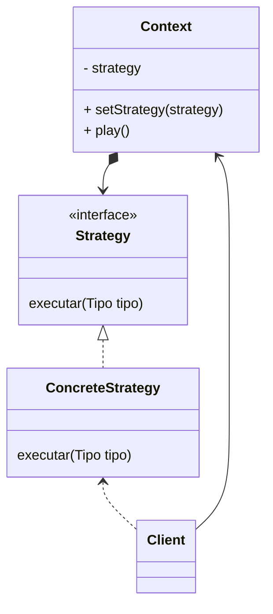

```mermaid
classDiagram
    
    
    Context *--> Strategy
    class Context{
        - strategy
        + setStrategy(strategy)
        + play()
    }
    Client --> Context
    

    class Strategy {
        <<interface>>
        executar(Tipo tipo)
    }

    
    class ConcreteStrategy {
        executar(Tipo tipo)
    }
    Strategy <|..  ConcreteStrategy


    ConcreteStrategy <.. Client
    class Client
    
```